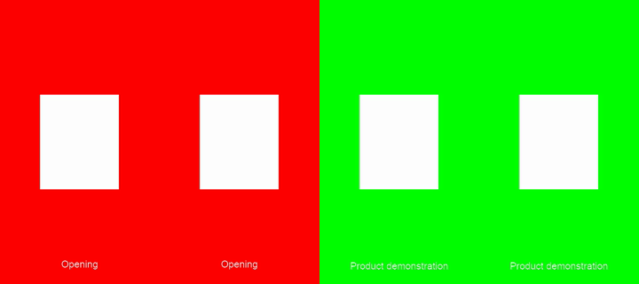

# Agent Video Workbench

An open-source Rust video workbench for an external persistent agent. The first
user is an iPhone content creator who wants to send footage, review drafts, and
request revisions conversationally. The planned broader product supports multiple
recordings, reusable styles, alternative openings and delivery variants.

**Status: Rust SDR editing prototype, candidate evaluation and product
specifications, October 2, 2026.** The CLI implements transactional projects,
managed original import, synchronous verified renders, source protection and
portable media backup. Local packaging scripts are available. The
[development guide](DEVELOPMENT.md) describes the synthetic editing/render loop;
real phone and hosted-bot acceptance remains pending. See the
[implementation inventory](docs/implementation-status.md) for precise limits.
`agent-video-workbench` is a provisional repository name; a product name remains
open. Reelwright is already used by other video products and a GitHub project.

**Recommended starting point:** extend the MIT-licensed AgentCut Rust core and
renderer in a focused application, with durable transactional project history,
iPhone ingest, transcription, and a small agent interface. Pin the upstream
revision. The prototype replaces the best-effort journal with SQLite and adapts
rotation handling; real phone/host qualification remains necessary. Keep
OpenReelio as the alternative if the library boundary proves unsuitable.

The external bot owns conversation, reasoning, and its own memory. This tool
owns media, editable projects, source references, revisions, jobs, and render
evidence. FFmpeg supplies media processing; a GUI is unnecessary.

| Document | What it answers |
| --- | --- |
| [Product plan](docs/product-plan.md) | Full creator workflow, 24 capabilities, daily use, portability and stable-release milestones |
| [Implementation status](docs/implementation-status.md) | What the Rust prototype currently implements and what remains proposed |
| [Development guide](DEVELOPMENT.md) | Run the existing SDR prototype, application regression and native packaging scripts |
| [Foundation decision](docs/decision.md) | Adopt, extend, fork, or build; first complete creator workflow |
| [Candidate research](docs/research.md) | Pinned source audit, licenses, installs, verified edits, limitations |
| [Architecture](docs/architecture.md) | Rust boundaries, durable state, exact timing, inspection, rendering, recovery |
| [Initial roadmap](docs/roadmap.md) | First end-to-end milestones and their relationship to the broader product |
| [Expanded backlog](docs/implementation-backlog.md) | Next implementation slices, 22 epics, dependencies and acceptance boundaries |
| [Editing specifications](docs/specs/editing-workflows.md) | Multi-source timelines, B-roll, captions, language variants, audio, framing and templates |
| [Project lifecycle](docs/specs/project-lifecycle.md) | Variants, profiles, review comments, workspace library, retention and portable projects |
| [Agent protocol](docs/specs/agent-protocol.md) | Discovery, atomic requests, resume context, structured recovery and draft wire schemas |
| [Media pipeline](docs/specs/media-pipeline.md) | iPhone input matrix, analysis graph, color, multiple formats and delivery packages |
| [Distribution and workers](docs/specs/distribution-and-workers.md) | Downloadable installation, host routes, persistent jobs, resource limits and upgrades |
| [Quality and performance](docs/specs/quality-and-performance.md) | Fixture coverage, output checks, measurement method and release qualification |
| [Hosted-bot compatibility](docs/host-compatibility.md) | Dots, Grok Bot, Muse, installation, transfer, storage, GPU assumptions |
| [Evaluation](evaluation/README.md) | Reproduce the tests and inspect generated artifacts |

The MVP is the first delivery milestone. The next creator workflow combines
multiple phone recordings and B-roll, preserves dialogue, compares named hook
variants, applies versioned styles, incorporates comments on old previews, and
exports several aspect/language variants from the same project. Those features
have concrete semantics and acceptance criteria in the specifications above.

For the current Rust prototype, use Rust 1.99 or newer as declared by the
manifest. These commands exercise project persistence:

```sh
cargo run --locked -- create ../avw-demo-project --name "Demo"
cargo run --locked -- status ../avw-demo-project
cargo run --locked -- history ../avw-demo-project
```

The example keeps project data outside this source checkout. The existing native
archive installer requires no Rust compiler; published cross-platform release
bundles and hosted-bot qualification remain planned.
Draft protocol examples are in [specs/schemas](specs/schemas/README.md).

Built and ran AgentCut, ave, and OpenReelio from pinned source on Apple Silicon.
The synthetic edit retained two ranges, removed a four-second pause, burned
captions, and rendered a draft. AgentCut also restored an omitted interval in
one batch, changed captions, and undid/redid the revision across CLI processes.
These checks do not establish real iPhone, HDR, transcription, long-video, or
hosted-bot compatibility.



Software in this repository is MIT licensed. External agents, optional hosted
transcription, storage, bandwidth, and compute can cost money. FFmpeg builds,
models, and fonts retain their own licenses. No proprietary model service is
required by the planned editor.
