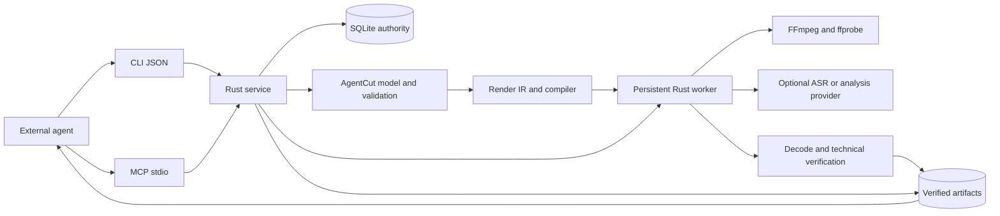

# Implemented architecture

This describes the **0.3.1** Rust application. See the
[interface reference](agent-api.md) for wire behavior and
[implementation status](implementation-status.md) for executed evidence and
support limits. The [product plan](product-plan.md) and
[specifications](specs/agent-protocol.md) retain broader design targets.

## Runtime boundaries

The application is one Rust package with a library and the `avw` binary.
It reuses commit-pinned AgentCut core/render libraries through explicit adapters;
AgentCut's best-effort CLI journal is not used for project authority.

| Modules | Responsibility |
| --- | --- |
| `main`, `mcp`, `service`, `json` | CLI/stdio transport, shared typed requests, root-scoped paths, strict parsing and response envelopes |
| `store`, `storage`, `policy` | SQLite transactions/revisions/replay, owned objects, verification/backup/relink/retention, source coverage |
| `workflow`, `studio`, `library` | Transcript-to-caption composition, selective edits, profiles/templates/variants, review decisions and portable libraries |
| `media`, `color`, `audio`, `animation` | Backend probing, render adaptation, tone mapping, audio processing and supported geometry animation |
| `inspect`, `analysis`, `tracking`, `asr` | Bounded source evidence, cached analysis, selected-region tracking and optional local transcription |
| `jobs`, `process` | Frozen queues, owner locks/fencing, child limits/cancellation and attempt recovery |
| `transfer`, `delivery`, `interchange` | Scoped downloads, verified review packages and supported-cut OTIO exchange |

The external agent chooses stories, reviews evidence and delivers files through
its host. The service contains no conversational model or social publisher.

## Durable project state

A project contains `project.sqlite`, `originals/`, `analysis/`, `cache/`,
`renders/` and `exports/`. SQLite schema 4 is the sole editing authority. It
holds the head, immutable revision snapshots/history, request outcomes,
operational job state and artifact references. Creator decisions are versioned
project extensions. JSON snapshots and exports are derived views.

Managed imports copy/probe/hash staged bytes before publishing content-addressed
originals. Stable asset IDs bind those objects to the project; hashes verify
identity on use and relink. Originals referenced by any historical revision
remain retained. Imported fonts and images are owned objects too.

Use persistent local storage with working OS locks. SQLite uses WAL and FULL
synchronization; object storage or an arbitrary network mount is not an equivalent
live database. Process lifetime is separate from file persistence.

### Edit transaction

1. Parse a typed request and check its intent/key.
2. Begin the write transaction; replay an existing matching outcome or check
   `expectedRevision` against the head inside the transaction.
3. Expand creator operations into a candidate snapshot; validate the domain,
   source references, caption layout and protected coverage.
4. Commit the new head, immutable history and outcome together, then acknowledge.

A failure commits neither a new head nor a success outcome. Same-key/same-intent
replay survives a lost reply; changed intent conflicts. Dry-run validates without
committing. Whole-snapshot `restore` appends a new revision; selective
`restore-omission` reconstructs recorded source footage while preserving other
later changes. Revision numbers are not reused.

Protection requires temporal source coverage in the selected outputs. It does
not certify that a crop or overlay leaves the protected subject visible.

## Source time and editable analysis

The domain uses integer values and rational rates. Source PTS/timebases are
preserved for frame indexing; VFR frame positions are not inferred from average
fps. Creator cuts/cues use half-open millisecond intervals relative to the
container origin. `compose` creates a 30 fps output; frame rounding is explicit
in the render plan. Proxies retain source maps and are not silently substituted
for originals in final rendering.

ASR and analysis are independently cached by source/tool/model/settings identity.
They return evidence without editing history. Reviewed transcript import creates
source-linked cues; compose maps their intersections through retained cuts.
Corrections, chosen analysis versions and output captions remain editable.
Changing style does not retranscribe. New analysis does not overwrite reviewed
corrections; changed alignment requires review.

Source orientation and SAR are applied once. PQ/HLG sources use versioned
linear-light Mobius tone mapping and BT.2020-to-BT.709 conversion before SDR
compositing, with a fixed 100-nit reference and 1000-nit peak policy. Original
HDR bytes remain intact. Delivery is SDR H.264/AAC; HDR masters and unsupported
color paths refuse. Generated pixel/sync tests are separate from real-camera
appearance approval.

## Frozen jobs and artifact publication

Render, transcription and analysis creation persist a job with frozen input
revision and tool identities. A batch freezes 1–32 distinct sequences atomically
and creates independent child jobs. Larger priorities run first with stable
ties. One owner holds each project's worker lock; attempts have generation
fencing and persisted state. A worker reconciles abandoned attempts as
interrupted before draining the queue.

Jobs run as `queued` then `running`, can enter `verifying`, and finish as
`succeeded`, `failed`, `cancelled` or `interrupted`. Verification precedes
success; short stages may finish between polls. Batch status aggregates
its children. Retry starts a fresh attempt rather than resuming an FFmpeg encode
at its last frame. Later project edits do not alter frozen jobs.

Processes receive argument vectors rather than shell-built media commands.
Owned process groups support bounded cancellation and Linux parent-death cleanup.
Child address space, files, logs and deadlines are bounded; operators still
control aggregate host resources and disk. Frozen backend/provider hashes are
checked on use.

Encoding writes an attempt-specific partial. Full decode and technical QC check
frame count/cadence, geometry, color tags, audio and requested loudness before
publication. A failed attempt preserves earlier verified finals. Each succeeded
render has an MP4, matching SRT/VTT, cover, indexed contact sheet and manifest.
`artifact` rechecks content hashes; `delivery` copies verified files to a new
bundle. Its manifest records failed children and feedback; the HTML displays
successful videos. Technical QC cannot judge story, caption accuracy or crop
appearance.

## Backup, maintenance and trust

Backup uses a consistent SQLite copy and **all historical originals**, sealed
with verified hashes. It excludes reproducible analysis, render outputs and
review packages. Restore checks the bundle and creates a fresh editable project;
derived jobs become `unavailable`. Regenerate them with new requests/keys.
Keep a delivery bundle separately if exports must travel with the backup.

Lease-aware cache collection defaults to preview. Opt-in worker retention and
scheduled `maintain` remove aged reproducible analysis or terminal scratch,
retaining originals/history/succeeded artifacts and recoverable attempts.
Missing or corrupt originals are reported; relink accepts only the retained hash.

CLI workspace mode and MCP scope service file paths to an existing root. This
is a local single-user service with no remote HTTP transport or account system.
Configured provider executables are trusted operator programs: resource limits
and result validation do not create a filesystem sandbox. Downloads require
operator-approved HTTPS hosts; transient signed URLs do not enter durable
project history. See [deployment](deployment.md) for operation and upgrades.
