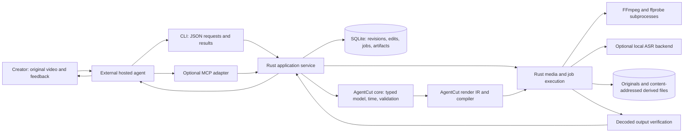

# Proposed architecture

This document describes future Rust application behavior. `avw` is a provisional
CLI spelling. The initial implemented subset is documented in
[DEVELOPMENT.md](../DEVELOPMENT.md); the broader interface below remains proposed.

Use a small workspace: `avw-core` for our source references, styles and editorial
metadata; `avw-store` for transactions/revisions; `avw-media` for ingest,
inspection, ASR adapters and the render backend adapter; `avw-cli` for command
parsing and job execution. Add `avw-mcp` only when a target host needs it. These
are logical boundaries, not a requirement to create five crates on day one.
Prefer two initial crates, core and CLI, until the separation earns its cost.

Pin AgentCut core/render to the audited commit with Cargo.lock. Keep its pure
`apply_batch` validation boundary; do not use the existing best-effort
`ProjectRepository` as our durable store. Adapt media probing/render IR through
one narrow module. Fix rotation input handling or explicitly normalize a
derivative before it reaches the affected path; do not hide a renderer patch
in a shell alias. Track patches and upstream licenses. A changed upstream model
requires explicit migration tests and an intentional dependency update.

**One durable state authority.** A project directory contains `project.sqlite`,
`originals/`, `analysis/`, `cache/`, `renders/`, and `exports/`. SQLite stores
the head revision, immutable revision snapshots, parent links, authored edit
batches, results keyed by request idempotency key, styles, semantic references,
and job/artifact manifests. Exported JSON is a readable, versioned snapshot of
one revision, not a second writable source of truth. Editing/importing such an
export creates a validated new revision rather than silently replacing the DB.

The directory survives process and conversation resets only when placed on
the host's actual persistent storage. Local block storage is the initial DB
target. Do not put SQLite WAL files on object storage or assume networked
filesystem locking has local-disk semantics. A remote worker owns its local DB
and durable volume; blob storage can hold originals and backups later.

Represent each original by a stable asset ID, content SHA-256, byte size,
container/stream metadata, and portable relative locator. Copy/import bytes
once, or explicitly bind an existing immutable location; verify and relink by
content identity. Never overwrite an original. Fonts, overlays and transcript
artifacts also have IDs, hashes and license/provenance references. Cache cleanup
can remove only derived objects. A reference is durable only while its original
location remains available, so managed import is the default.

Each output has a sequence ID and a creator-facing name such as
`product-demo-1`. Clip IDs survive trims/moves; splits record lineage. Store
source-range mappings for every output segment, including omitted ranges and
the operation/reason that removed them. Semantic annotations reference source
time and asset IDs: sentence IDs/word IDs, `product-demonstration`, and protected
intervals. These are explicit project data, independent of an agent's memory.
The project can answer “which sentence did revision 12 remove?” without replaying
a conversation or guessing from the final MP4.

Use integer values plus rational rates for time. Original video addressing
uses stream PTS/timebase, with a timestamp index when needed. Output frames use
an exact rate such as 30/1 or 30000/1001; audio uses sample counts. VFR source
frame numbers must not be inferred from average fps. Maintain an explicit
source-time-to-proxy/output mapping; record rounding at edit boundaries. A cut
request can point to transcript words and source ranges while its resulting
output duration is an exact number of frames.

**Commit protocol:** parse a typed batch, check the schema, begin a SQLite
write transaction, check idempotency and expected revision, apply to a candidate
snapshot, validate the whole candidate and protected-source policy, then commit
snapshot, revision, operations and response together. Return success only after
that transaction commits. SQLite serializes writers; the expected revision is
checked inside the transaction. Same key/same request returns its prior outcome;
same key/different request is a structured conflict. Retain outcomes for project
life instead of relying on a bounded undo journal. `dry-run` runs validation
without committing or recording success.

Use WAL with appropriate durable synchronization on a tested local filesystem.
Store schema version and migrate transactionally with a backup. Revision
snapshots and history live in the same DB transaction; loss of history must
never be silently treated as a clean edit. Restore/undo creates a new revision
referencing the earlier snapshot; revision numbers are never reused. For
selective restoration, use the removed source-range record and emit a fresh
operation batch, preserving later unrelated edits.

Back up using SQLite's consistent backup API plus a referenced asset manifest.
Portable bundles include the DB snapshot, styles/fonts with permitted
redistribution, inspection artifacts, and optionally originals with a size
estimate. Restore checks hashes and reports missing objects. A fresh hosted
computer can reinstall tools, open the bundle, and continue editing. Exporting
a current JSON file without history/media is not a sufficient project backup.

**Ingest and inspection.** Stream file transfer, hash it, probe streams, and
persist metadata before analysis. Normalize orientation exactly once, honor
sample aspect ratio and color metadata, and inspect actual PTS for VFR. Proxy
generation produces low-resolution SDR video at a documented cadence, with
timing mapping and zero rotation metadata. A full working conversion is only
created when required by the source/render path; a mandatory full mezzanine for
every long video can cost more time/disk than it saves.

SDR output is the initial delivery policy. HDR HLG/PQ needs an explicit
color-managed, tested tone-map path, accurate tags, and phone review. Treat Dolby
Vision variants and other unsupported modes as named capability failures.
The current AgentCut compiler's basic pixel-format conversion does not establish
HDR correctness. Keep original HDR bytes even when the working proxy/output is
SDR. Publish a supported-input matrix based on fixtures and actual phone samples.

Analysis is an independently cached job. Provide ffprobe metadata, timestamped
speech/word transcripts, confidence where supplied, silence intervals, scene
change scores/intervals, contact sheets, selected full frames, and short source
or sequence previews. Scene boundaries and silence are suggestions; neither
proves semantic importance. Expose paginated/searchable transcript ranges and
bounded frame retrieval. Contact sheets carry a separate JSON index with
asset/revision ID, each tile's source/output timestamp, and locator.

Use an optional local `whisper.cpp` process as the first ASR backend, behind a
Rust adapter. Accept imported timestamped transcripts as another provider.
Verify the actual model artifact license/checksum and record backend/model
version. Local transcription has compute costs without model API fees. Word
timing remains an estimate; retain user corrections and inspect cuts with
handles. A separately configured remote ASR adapter can be added without making
it the only path or embedding conversational reasoning. No ASR model was run in
the candidate evaluation.

Create captions from source-word references and map them through retained
timeline intervals after edits. Store raw transcript, corrections, caption text,
and style separately so smaller captions do not rerun transcription. Detect
overlong lines, off-canvas placement, cue overlap, missing glyphs/fonts and
cut-boundary timing. Bind a real font asset, define crop-relative safe margins,
and verify the rendered words visually. Ship one readable style; karaoke and
animated word effects are later work. Preserve A/V links and prevent duplicate
embedded-plus-dedicated audio in the adapter.

**Agent contract.** CLI stdout is one JSON envelope for success and failure;
stderr carries logs/progress. Use structured stdin or `--request <file>` for
batches, large content, and paths; avoid forcing the model to invent shell
escaping. Commands have schemas, examples, capabilities, stable IDs, precise
errors, and explicit project handles. Typical proposed vocabulary:

| Command family | Purpose |
| --- | --- |
| `doctor`, `capabilities`, `schema`, `agent-guide` | Discover this host's supported operations and protocol |
| `project create/open/status/export/restore` | Durable lifecycle and portable recovery |
| `asset import/list/relink`, `inspect` | Original media and indexed analysis |
| `transcript search`, `annotation protect` | Find speech and preserve demonstrations |
| `edit validate/apply`, `history`, `diff`, `undo` | Reviewable, reversible transactional edits |
| `preview`, `render start`, `job status/cancel` | Bounded tool calls for long-running media work |
| `verify`, `artifact list/get` | Associate checked results with the correct revision |

For example, a proposed operation request would contain `projectId`,
`expectedRevision`, `idempotencyKey`, a short creator instruction/reason, and
typed operations targeting stable IDs. A result includes `ok`, `apiVersion`,
`requestId`, new `revision`, created/changed IDs, warnings, and artifact/job
references. A failure includes a stable code, phase, affected ID/path, retry
policy and suggested recovery. CLI argument errors also obey that contract.
Request/operation schemas must be generated or checked against Rust types.

Publish compact capability summaries and per-command/per-operation schemas;
do not preload all project/operation data into model context. MCP is a thin
adapter to the same Rust service, including structured error data, project
resources and artifact handles. Start with stdio where available; add a remote
transport only for an actual hosted-bot route. Long jobs return immediately
with job IDs, allowing poll/cancel without holding a tool call for an hour.

On resume, the agent opens `project status`: current revision, asset presence,
output names/IDs, saved style, protected ranges, last changes, pending/failed
jobs, and previews/finals tied to specific revisions. It then searches history
and transcript for the requested sentence or opening. A render from an earlier
revision remains accessible and visibly labeled as that revision. The agent
must not confuse it with the latest project state.

**Rendering and failure recovery.** Compile one immutable revision to a render
plan. Its hash includes relevant source/derivative hashes, timing/crop/caption
data, fonts, export preset version, backend build/configuration and render
parameters. The project may change during rendering without changing the
captured plan. Final render uses originals or an explicitly approved working
derivative; a proxy is never silently substituted for the final.

Render through subprocess argument vectors, not shell strings. Treat subtitle
text as literal data, use controlled text/subtitle files, and validate any
filter parameters. Stream progress with bounded retained log tails. Encode to
a job/attempt-specific partial path, then decode/probe/check it, atomically
publish the file, and commit its manifest/reference. Failed attempts never
replace a known good final. Cancellation signals the owned process group and
has a bounded shutdown path.

Jobs persist `queued/running/verifying/succeeded/failed/cancelled/interrupted`,
input revision/plan hash, owner/lease/heartbeat, output target, progress, attempt
and error. Restart reconciles expired owners and existing outputs: a matching
published manifest may complete a job; an unverified partial is discarded or
retained as diagnostic data. Retry can reuse completed content-addressed stages.
Do not promise resuming an arbitrary FFmpeg encode from its last frame. Long
segmented renders can be added later after seam correctness is measured.

| Failure | Required behavior |
| --- | --- |
| Response lost after edit commit | Replay the persisted idempotent result |
| Revision conflict | Return current revision; agent reads diff and rebuilds its proposal |
| Bad operation or protected range removed | Reject the whole batch with unchanged head/history |
| Missing/changed source | Refuse render; report the asset/hash and relink route |
| Disk full or expired download | Preserve sources/head; mark job failure with recoverable stage |
| Renderer/model failure | Keep diagnostic tail and input hashes; retry only the failed job/stage |
| Process/host restart | Reopen persisted state; reconcile interrupted jobs; reinstall tools if needed |
| Hardware encode unavailable | Expose the failure; an explicitly selected `auto` policy may choose CPU and records that choice |
| Bad rendered dimensions/captions/audio | Keep output as failed QC/draft; do not mark it final |

Verify every deliverable independently: fully decode the short output; measure
stream durations, decoded video frame count, rate, dimensions, rotation/SAR,
codec/pixel format/color tags and expected audio. Check A/V alignment at edits,
black/frozen-frame candidates, clipping/loudness, caption presence/timing and
protected-source coverage. Sample the actual rendered file around each cut,
caption change and crop, not only a preview graph. Produce a timestamped sheet
and structured report. Automated measures cannot certify a good story, correct
speech recognition, flattering crop or exact color appearance; the agent's
available senses and the creator's preview review close those gaps.

**Efficiency policy.** Decode short requested ranges for previews. Analyze each
source/model version once; index/search transcripts instead of resending them.
Use low-resolution proxies and limited representative frames, while retaining
full-resolution product/key-shot frames. Cache keys include source hash,
algorithm/model/tool versions and settings. New caption styles reuse speech
analysis; new edits reuse source inspections. Measure cold and warm runs, peak
RSS, scratch/durable disk use, elapsed time, and output quality on short and
long inputs. Benchmark CPU before selecting GPU encoding or concurrent jobs;
hardware decode/encode can require CPU filters and costly transfers, so a GPU
name alone is not a performance conclusion.
