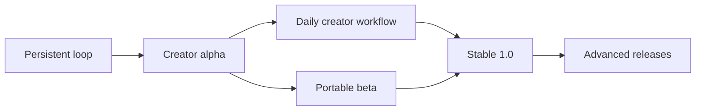

# Product plan beyond the first creator workflow

Status: product requirements established October 2, 2026; updated for 0.3.1
on October 3. Many workflows below now exist in the Linux CLI/MCP workbench,
including HDR-to-SDR, analysis, profiles/templates, variants, batch delivery,
review and backup. [Implementation status](implementation-status.md) records
which behavior is implemented and tested. Remaining camera, script, platform
and hosted-account acceptance gates still apply. Milestone names are planning
labels, not published releases; the specifications include broader targets.

The product should become a dependable editing workbench that a hosted agent
can install, inspect, operate and resume. The creator sends footage and intent,
reviews tangible results, and returns days later to refine or repurpose them.
The workbench preserves the editorial record across agents, computers, styles
and output formats. Conversational reasoning stays with the external agent.

The first workflow validates one recording and three shorts. The broader
product handles a collection of recordings, B-roll, recurring creator styles,
alternative openings, several aspect ratios, accessible captions, reusable
project templates, and reliable delivery. It remains useful from a CLI even
if an optional browser review page is never installed.

## Workflows to support

| Creator request | Product behavior | Completion evidence |
| --- | --- | --- |
| “Use yesterday's demo and the close-up I just uploaded.” | Import several originals; retain distinct source IDs; place B-roll over continuous speech | Source map identifies both files; speech remains synchronized and uninterrupted |
| “Try a second opening, but keep this version.” | Create a named sequence variant from an explicit revision | Both variants can be previewed, compared and restored independently |
| “Make this one for vertical, square and landscape.” | Produce related output variants with independent framing and shared source edits | Three checked files with the correct dimensions and variant provenance |
| “Use my usual captions, except make these smaller.” | Pin a saved style version, then create a sequence override | The override survives restart and does not change other projects |
| “Leave the demonstration intact even though I'm not speaking.” | Apply a protected source interval to selected outputs | Edit validation reports required coverage and rejects an accidental removal |
| “Fix the product name everywhere.” | Correct transcript text without changing audio; update selected caption variants | Diff lists affected words/cues; timing and original audio remain unchanged |
| “Make an English version and a translated caption version.” | Preserve the source transcript and attach separate language variants | Both exports retain timing and record translation provenance and review status |
| “At 00:18, don't cover the product with text.” | Resolve the comment against the reviewed artifact's revision and time map | Caption/framing change targets the correct source shot after later edits |
| “Make five more using this project's style and structure.” | Instantiate a versioned template with new source bindings | Missing bindings and incompatible durations are reported before any render |
| “Continue on a new computer.” | Install a compatible tool bundle and restore a portable project | History, originals, styles and available artifacts resolve by hash |

## Capability catalog

Each feature has one primary delivery milestone and a specification. “Baseline”
means an earlier subset is required; it does not mean the full feature exists.

| ID | Capability | Milestone | Specification / required result |
| --- | --- | --- | --- |
| F01 | Durable edits, history, selective restoration | M0 baseline; M2 richer diff | [Lifecycle](specs/project-lifecycle.md): snapshots, operations and retry outcomes agree after restart |
| F02 | Original-file import and iPhone ingest | M1 | [Media](specs/media-pipeline.md): orientation, HEVC/VFR, supported HDR conversion, resumable transfer |
| F03 | Source inspection and transcript search | M1 | [Media](specs/media-pipeline.md): paginated words, scenes, silence, frames and source previews |
| F04 | Editable captions and subtitle files | M1 | [Editing](specs/editing-workflows.md): source-linked cues, corrections, layout, SRT/VTT export |
| F05 | Static framing and safe areas | M1 | [Editing](specs/editing-workflows.md): independent framing per output, no silent crop substitution |
| F06 | Voice and music mixing | M1 gain; M2 mixing | [Editing](specs/editing-workflows.md): linked audio, fades, ducking and checked loudness |
| F07 | Multiple recordings, B-roll and reusable assets | M2 | [Editing](specs/editing-workflows.md): layered visuals over continuous speech with clear asset lineage |
| F08 | Richer timeline edits | M2 | [Editing](specs/editing-workflows.md): ripple/overwrite, J/L cuts, restrained transitions, speed and freeze |
| F09 | Alternative hooks and named versions | M2 | [Lifecycle](specs/project-lifecycle.md): explicit variant creation, comparison and selective changes |
| F10 | Creator profiles and brand kits | M2 | [Lifecycle](specs/project-lifecycle.md): pinned fonts, colors, caption/audio/export defaults and overrides |
| F11 | Templates and repeatable clip sets | M2 | [Editing](specs/editing-workflows.md): parameterized slots and constraints, previewable expansion into edits |
| F12 | Multiple aspect ratios and delivery packages | M2 | [Media](specs/media-pipeline.md): batch renders, cover frames, captions and manifests |
| F13 | Multilingual captions and accessibility | M3 | [Editing](specs/editing-workflows.md): separate language layers, font coverage, RTL fixtures, speaker labels |
| F14 | Keyframed and assisted reframing | M2 manual; M5 tracking | [Editing](specs/editing-workflows.md): bounded crop motion, editable proposals and occlusion fallback |
| F15 | Color correction and advanced HDR delivery | M5 | [Media](specs/media-pipeline.md): versioned color decisions and separately qualified output profiles |
| F16 | Persistent workers and batch scheduling | M1 jobs; M3 scheduling | [Deployment](specs/distribution-and-workers.md): bounded resources, cancel, leases and restart recovery |
| F17 | Portable projects and backup/restore | M3 | [Lifecycle](specs/project-lifecycle.md): consistent DB backup and verified referenced objects |
| F18 | Discoverable CLI and optional MCP | M0 CLI; M3 MCP | [Agent protocol](specs/agent-protocol.md): shared operations, errors and compact resume context |
| F19 | Downloadable installation and upgrades | M1 one host; M3 matrix | [Deployment](specs/distribution-and-workers.md): clean installation without a compiler or GUI |
| F20 | Timestamped review and comparison | M2 | [Lifecycle](specs/project-lifecycle.md): comments pinned to artifacts; optional static review bundle |
| F21 | Timeline interchange | M5 | [Editing](specs/editing-workflows.md): validated interchange subset and explicit loss report |
| F22 | Analysis-provider and preset extensions | M5 | [Deployment](specs/distribution-and-workers.md): versioned process boundary and reproducible provenance |
| F23 | Workspace library and project catalog | M2 | [Lifecycle](specs/project-lifecycle.md): find prior work without scanning conversation history |
| F24 | Quality, performance and cost reports | M1 checks; M4 budgets | [Quality](specs/quality-and-performance.md): measured outcomes, resource use and known/unknown costs |

## Delivery milestones

| Milestone | Usable outcome | Exit criteria |
| --- | --- | --- |
| M0 — Persistent editing loop | One short can be revised after reopening | Complete the original roadmap's foundation/prototype checks; actual render plus transactional state |
| M1 — Creator alpha | One recording becomes up to three reviewed shorts | Real phone ingest, transcript/caption/framing workflow, source protection, durable render jobs and one tested host route |
| M2 — Daily creator workflow | Multiple sources, reusable styles, variants and output formats | Complete the multi-source and repurposing scenarios below; no cross-variant surprises |
| M3 — Portable beta | Same projects survive worker/host changes and long batches | Install matrix, MCP where usable, backup restore, transfer recovery and per-project scheduling limits |
| M4 — Stable 1.0 | A documented compatibility contract and dependable release process | Migration/conformance suite, supported-media matrix, measured long-input resource budgets, upgrade/rollback drills |
| M5 — Advanced releases | Assisted motion, richer color and interoperability | Each feature has its own media/quality gates and can be unavailable without breaking basic editing |

M2 and M3 can progress independently after their prerequisites. Critical
transaction, original-preservation and interrupted-job behavior is required
before creator alpha; the later durability milestone broadens coverage and
portability. A milestone never postpones an earlier workflow's data integrity.

## Beyond-MVP acceptance scenarios

**Multi-source story:** import three phone originals and a logo, assemble a
voice-led short with two B-roll shots, keep the demonstration protected, and
produce vertical and square variants. Replacing one B-roll shot changes only
the intended variant and leaves the voice edit intact. A source map and an A/V
review demonstrate the result.

**Returning creator:** start a project from a saved profile, finish a draft,
then update the profile's font and caption size. The previous draft remains
reproducible. The agent previews the profile upgrade in a named variant and
applies it explicitly. It can explain every style difference without rerunning
transcription.

**Revision after feedback:** attach a comment to the old preview at 18 seconds,
then change the opening in a newer revision. Resuming from a fresh agent session
still locates the commented source interval. If that interval has been removed,
report an unresolved reference and offer its source preview rather than moving
the comment to an unrelated shot.

**Portable batch target (broader than the current backup):** queue several
aspect/language variants, interrupt the worker, restore the project on another
supported machine, and finish the batch.
Verified earlier exports stay available. Completed analysis stages are reused
when their model/tool fingerprints match; unavailable models or fonts are
reported precisely. Delivery distinguishes completed, failed and pending items.
Current backup preserves history and all originals but excludes derived analysis/exports and
marks derived jobs unavailable. Regenerate with fresh requests after restore;
retain deliveries separately. Resuming an interrupted batch from this portable
backup is not an implemented contract.

**Long-recording reuse:** analyze one 60-minute recording, make several shorts,
then change a caption style. The change does not transcribe or transfer the
original again. Report elapsed time, peak memory, disk and cache reuse on the
published benchmark profile; no performance claim is inferred from Rust alone.

## Product boundaries and decisions

The external agent selects stories, interprets feedback and requests operations.
The workbench offers measurements, editable proposals and deterministic execution.
Local ASR and optional tracking are analysis components with recorded model
versions. A new conversation engine, social network, or mandatory desktop editor
is outside this product direction.

Single-creator workspaces and explicitly named variants are the initial
collaboration model. Automatic merging of arbitrary concurrent timelines,
multi-tenant SaaS, multicam synchronization, synthetic presenters/voice cloning,
direct social publishing and camera-specific depth effects need separate
proposals before implementation. Their absence does not block the workbench's
complete editing/review/delivery workflow.

See the [implementation backlog](implementation-backlog.md) for dependency order,
issue-sized next work and acceptance checks. Existing [candidate findings](research.md)
remain adoption constraints for every milestone.
